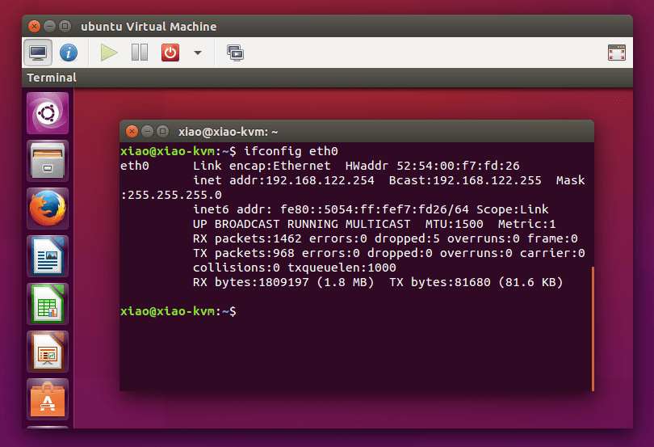

# Working with Virtual Machines

## Creating Disk Images

- WHile it is possible to boot a VM without any storage, just as we can boot a thin client across the network or, boot a system from live CD Environment.

- Most virtual machines will need there own storage, their own virtual hard drive to boot from and save to files.

- We can attach physical hard drives to VMs, but the most common pattern for virtual machines disks is to represent them with disk image files.

- Disk Image Files are File Systems that exist whitin a standard file on the host's hard drive. To use a disk image with our guest, we will create the file by providing some parammetere for it.

- Once, we boot our Guest System, the installer or user will create partitions as needed.

- To do this, we will use the `qemu-img` utility. We need to tell this utility 3 primary things:

  - The format of the disk image.
  - The path and name of the disk image.
  - The size of the Virtual Disk

- Starting with the formats, there ar 3 formats we have:

  - For creating a brand new image, we might work with `RAW` or `QCOW2` which are the most common formats.

  - The utility does support other types like `VHD` and so on, mostly for work with legacy images or conversions.

    - A `RAW` disk image acts like a regular block device, and on the host it takes whatever amount of space is specified for the disk image.

    - `QCOW2` stands for `QEMU Copy On Write Version 2` and is a more advanced format that allows for snapshots and other features.

      - A Copy-On-Write file system  makes a copy of disk blocks that are changed in a new location, rather than modyfing the existing ones.

      - This has some advantages like allowing easy snapshots.

      - QCOW2 images are also sparse, means they don't take up the space on the host untill data is actually written to them.

- Example:
  
  ```shell
  qemu-img create -f qcow2 mydisk.qcow2 50G
  # We have a disk image thats ready to act like a 50GB hard drive for my guest
  # It will grow in size on the host as files are added.
  ```

- Many Virtual Guests will have 1 disk image file associated with them as there primary disk, but it is possible to have multiple disk images attached to a single VM.

## Creating a VM

- Creating a Virtual Guest with QEMU at the command line can be littile intimidating.

- Guests are made up of primarily 2 things:

  - Configuration
  - Disk Image

- We now know how to create a disk image, so now let's focus on the configuration part.

- We will use the VNC Client to connect to the VM or Guest, to see what's going on. For now, we will dive into the example that we discussed in the previous lesson.

    Example:

    ```shell
    qemu-system-x86_64 \ # Create a guest with specfied architecture we want to use
    -enable-kvm \ # Use KVM instead of QEMU Emulation
    -cpu host \ # Use the host CPU
    -smp 4 \ # Number of Virtual CPU Cores provided to the guest
    -m 8G \ # Amount of RAM provided to the guest
    -k en-us \ # Keyboard Layout
    -vnc :0 \ # Show the guest screen using VNC at host port 5900
    -usbdevice tablet \ # Attach a USB 1.1 tablet device to make mousing better
    -drive file=disk_name.qcow2,if=virtio \ # Set the disk image guest will use
    -cdrom /path/to/iso \ # Attach the installer as CD ROM
    -boot d \ # Boot from the CD ROM
    ```

  - `-enable-kvm`

    - tells QEMU that we want to use KVM and paravirtualization with this guest
    - If this opetion is not specified QEMU will emulate it, instead of virtualizing it.
    - KVM let's us take advantage of the host's support for vitualization which is much faster than emulation.
    - This feature isn't available if we are running an architecture which is different from the host.

  - `-cpu <type/>`

    - tells QEMU to present the guest with a processor of a specific type
    - specifying `host` tells QEMU to use the host's CPU features.
    - If we leave this option out, QEMU will present the guest with a generic QEMU Processor model to the guest.
    - This is useful for taking advantage of the host's CPU features.
    - If we are running a VM on a different architecture, we can specify the architecture we want to use.

  - `-smp`

    - `smp` is short for `Symmetric Memory Multi-Processing` or `Shared Memory Multi-Processing`, it refers to the architecture most modern computers have.
    - It is used to tell QEMU, how many virtual cores to the CPU cores to give to the guest.

      - For very light loads, 1 core is sometimes enough.
      - And, we leave this option off, to provide the guest one Virtual CPU or vCPU core.
      - In the example, above we created a 4 core machine we used `-smp 4`.
      - We can get more granular too like by defining the chip topology, that is where the guest thinks it's vCPUs are in one or more sockets. With one or more cores per socket and so on.
      - Most modern systems benifit atleast from having 2 cores, but it depends on the workload, and we can set this value upto 256 cores, though that won't rflect the reality of most hosts.
      - We can specify more vCPUs than our host hardware has, but request sent to those will just be scheduled across the host's available cores.

    - Another architecture we might consider using instead of SMP is `NUMA` or `Non-Uniform Memory Architecture`, which allows us to specify different amount of memory per processor.

    - If we need this sort of arrangement, feel free to explore the QEMU documentation.

  - `-m <memory_in_GB>G` or `-m <memory_in_MB>M`

    - This option is used to specify the amount of RAM to give to the guest.
    - If we leave this off, QEMU will give the guest 128 MB of RAM, too little to really work with any modern OS.
    - We can set this as a nuber of Megabytes or Gigabytes.
    - This is one of the options that is too little to change easily later.
    - As long as we don't give the guest too little memory, it shpould boot and we can tune the amount if we want to make modifications latero on.

  - `-k <keyboard_layout>`

    - This option is used to specify the keyboard layout for the guest.
    - If we leave this off, QEMU will use the default keyboard layout for the guest.
    - When we connect through VNC we'll usually need to type things, and this options makes us make sure that keyboard behaves correctly.
    - Not all systems require this, but if you're connecting from a Mac or from certain other clients, it helps avoid bugs.
    - This is useful for making sure that the guest has the right keyboard layout for the user.

  - `vnc: `

    - provides a way for us to see the screen of the guest system, if we are working on a host across the network.
    - VNC stands for `Virtual Network Computing` and is a way to see the screen of a remote system.
    - It provides a handy, if not very fast or secure method of showing a remote system screen on our local system.
    - We can use this to see anything on the guest monitor, if it had one.
    - That includes the boot process, any graphical interface, and any text or console interface that guest mmay display.
    - It's not just for graphics even though VNC is usually used for Graphical Desktop sharing, it's better to think of this VNC Server as the guest's video card output.
    - There's no VNC Server running inside the guest.
    - The Server functionality is provided by QEMU on the host. So, this VNC session will still work even if there's no OS on the guest or, if the guest isn't an OS that supports running a VNC server itself.
    - `: 0` tells QEMU to start a VNC server for the guest on port 5900 on the host.
    - The 0 refers to the last digit of 5900. If we use 1, it will start on 5901 and so on.
    - Each guest needs to have it's own VNC port on the host, if we're using this option
  - When the guest starts, we will use the VNC CLient software to connect to the host's address with appropriate port number.
  - By default, there's no VNC password, and if connecting from a Mac using it's buil-in VNC Client, we need to do certain changes to workaround to it's password prompt.
  - There are other display options we can use, fi we're running a guest on the same computer, whose screen we're using.
  - VNC will work with any guest, local or remote in any OS.

- `usbdevice <device/>`

  - changes how the system tracks the mouse cursor and often resolves issues where the host mouse is shown in one place on the screen but the guest mouse is shown on another.
  - This feature is useful when we have a guest that will be using a graphical interface, but we can leave it off in any guest that doesn't need that.

- `-drive file=file_name.file_format, if=<interfac-type/>`

  - tells QEMU which resource to mount as a drive within the guest.
  - In our example it's the disk image file, `disk_name.qcow2` that we created earlier.
  - `if` tells QEMU which interface type to use for the drive. In our example, it's the `virtio` interface, which is generally what we want to use for speed reasons.
  - `virtio` is a paravirtualized driver provided by KVM, that is faster than the default `IDE` or `SATA` interfaces.
  - There are some other options we can use like setting specifially which  bus and device the disk should appear as, various limits we want to impose and so on.

- `-cdrom`

  - The `-cdrom` option is kind of shortcut option for drive that tells QEMU to mount an ISO image as a CD-ROM device.
  - This is what we will use to install OS on the guest.
  - This option will be removed once the installation is done, and we just want to startup the system normally.

- `-boot`

  - The `-boot` option tells QEMU to boot not from the disk image, but from the CD-ROM device with the ISO image.
  - `d` means the first CD-ROM device, `c` would mean the first hard drive.
  - `a` and `b` refer to floppy drives, which are less common these days.

- Because the QEMU command runs in, and takes over a  shell session , we need to be careful about closing terminals or disconnecting SSH Sesions when running the guests.

- We can run `temux` or `screen` to keep the session alive, or we can run the command in the background with `&` at the end of the command. So, if the connection is lost, the command will keep running, and the terminal isn't killed abruptly.

## Installing a Guest OS

- Our Guest is botting up, so let's connect to it and see what's going on.
- To access, we will open a VNC Viewer. Put the address of the QEMU host and the port number we specified in the command, and press enter to connect.

    

- The VNC Session sends the mouse and keyboard activity within the VNC Viewer Window to the guest so we can interact with it just we would interact with a regular computer.
- Now, Intall the Ubuntu OS as needed.

    

- Once the installation is done, we will shut down the system here. Ordinarilly, We would restart a new installed system but right now, we can't remove the installer disk image without powering the guest down.

- We will close this prompt and wait for the guest to boot into the live CD Environment. Than, we click on the top right choose > power off/logout > power off.

- We need to remove the disk image otherwise the guest will start right back up in the installer, and there's no point in that we already installed.

- Back, in the terminal, once the guest is shutdown we recall our previous command that we used to create the VM, and edit it.

    ```shell
    qemu-system-x86_64 \
    -enable-kvm \
    -cpu host \
    -smp 4 \
    -m 8G \
    -k en-us \
    -vnc :0 \
    -usbdevice tablet \
    -drive file=disk_name.qcow2,if=virtio \
    ```

    <code>We will remove the `-cdrom` option and the `-boot` option.</code>

    We can also switch the boot to `c` for the first hard drive instead of `d` for the Optical drive, but than if this disk image ever moves, we will get an error even though we will not be using it.

    And, we don't need these unused options cluttering up my command. We will run this modified command and the guest will boot.

- Once the guest is booted, we will dismiss the startup screens, and there you have the Ubuntu Desktop running as a QMU Guest with KVM, and we can use it just like a regular computer.

    

- We will open up the terminal here, and use the command `hostnamectl`, and we can use it to see what system knows about how's it running.

    

    Here we can clearly see it's showing KVM being used.

- And, if we run `lscpu`, and we can see that the guest processor thinks it's processor is Xeon Silver 4108, which is what the host actually has, and we can also see the 4 cores we specified here.

    

- We will run `lspci`, and that will show us the emulated PCI devices that the guest has including the various mainboard parts, the virtio storgae device, and intel network adapter.

    

- We can also run `lsusb`, and that will show us the USB devices that the guest has, including the tablet device that we added to make the mouse work better.

  And, when we reun the `lsmem` command, we can see the memory that the guest has, and we can see that it's 8GB, which is what we specified.

  

- One thing you might notice is that the display is not very good, we can improve the display a little bit by changing the resolution, but the emulated video adapter is let's say rather basic, and it has only 16MB of video RAM. So, that prevents us from having really smooth graphics or high resolutions.

  VNC limits us as well because it provides quite a less video bandwidth than a real video connection like HDMI or Display Port would have.

  This kind of basic display is fine for administrative tasks, but it's not nice to do a lot of work in.

  QEMU does provide other emulated video adapters, and we change their parameters to a degree or if we're feeling very adventurous, and have a compatible video card, we can pass through a video card to the guest. So, it can use the card, and a real monitor.

- We can make the copy of a disk image using the command:

    ```shell
    cp disk_name1.qcow2 disk_name2.qcow2
    ```