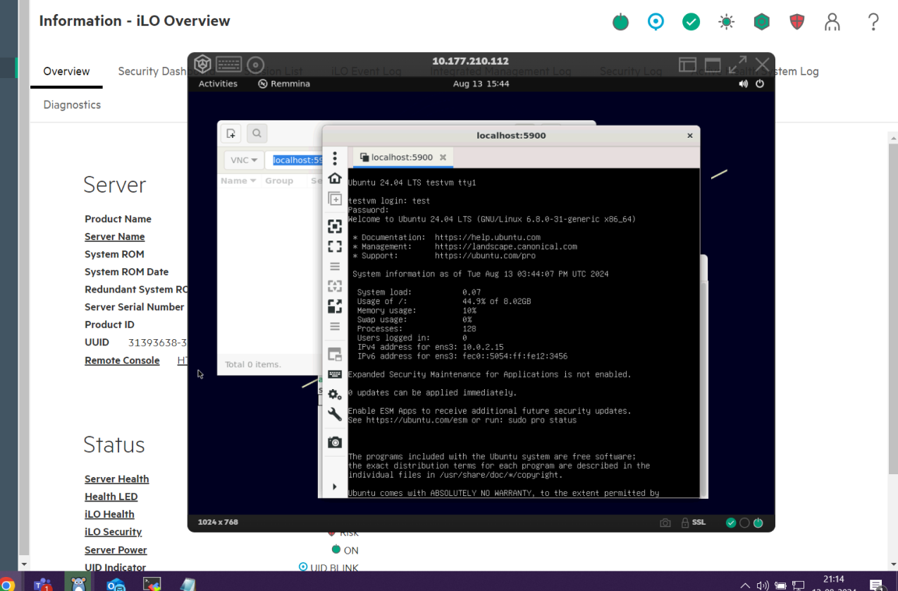

# VM Management Tools

## Exploring `libvert`

- Till now we have been doing everything with our guest configuration, and management manually at the command line. And, this is pretty tedious work.

- If we are working with guests a lot, it can be much nicer to use tools that can handle a lot of detail work for us.

- `libvert` provides an API for management tools like VERS and VERT Manager can use to manage QEMU and to connect with hypervisors.
  
  Use the following command to install the same:

  ```shell
  > sudo apt install libvirt-daemon-system libvirt-clients
  ```

  For changes to take place, on to the machine, you need to logout and back in to the machine.

- `libvirt` stores configurations for guest machines and other entities like networks, storage and so on as XML Files.

- It uses name domains for guest machine definitions and resources. These configuration files are read and managed by various front-end clients, and we can edit the files manually if we're so inclined.

- They are stored in `/etc/libvert/qemu`.

- `libvirt` api handles all the communication with QEMU, and it even sets up it's own network bridge and routing so that guests can participate in a shared NAT Network with the host.

- Out of the box, so to speak , network uses `192.168.122.x` space by default, adn the host is available at `192.168.122.1`. This bridge automatically setup for us is a huge time saver.

- `libvirt` also manages disk images, and snapshot and so on in a centralized way. It has a series of configuration files including one at `/etc/libvert/qemu.conf`, where we can set the defaults for any new guest, saving us from having to specify every little thing about our guests like we do with QEMU system commands.

- If we don't make any changes to this file, `libvert` uses same defaults for our new guests.

## Exploring Virtual Machine Manager

- Many Graphical VM Management Clients can use `libvirt` to manage guests.
- One of this is `virt-manager` or Virtual Machine Manager. We can install it using the command:

  ```shell
  > sudo apt install virt-manager
  ```

  We can open the application from the command line using the command `virt-manager`.

  In many cases, we will use this software to manage guests on our localhost, but we can also add connection to remote hosts, and manage guests on other hypervisors that way.

  

  We can create a New Guest on this host by clicking the button, with a shiny new monitor. In the interface, where we create a new machine, we have a variety options that look familiar for working with QEMU commands on the terminal. We can choose what to use to install from or boot from, if we alreadt have a pre-made image. If we boot from a pre-made image, like our existing QEMU guest, the image won't be moved automatically to the libvirt storage location.

  We either need to maintain that image where it is or create a volumne and import it manually using tools like `virsh`.

## Exploring `virsh`

- 